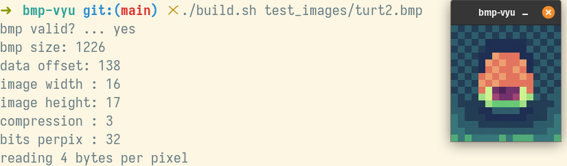

# bmp-vyu
An image viewer for .bmp bitmap files written in C using raylib.

```
bmp images of types (0, 3) bits/pixel (8, 16, 24, 32) are currently supported.
8bit and 4bit run length bmp imagesare not yet supported.
```

### Screenshot of current state
<p align="center"></p>
